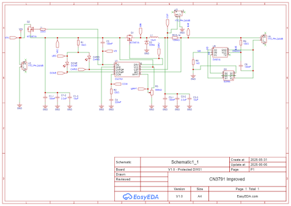

# Pete's Improved CN3791

## Introduction
I wanted a small, efficient, switch-mode, MPPT lithium-ion charger for some of my solar-powered [Meshtastic](https://www.meshtastic.org/) nodes and found the CN3791, made by [Shanghai Consonance](http://www.consonance-elec.com/en/), which seemed to fit the bill.

Various online vendors sell a common CN3791 board that looks like this:

  

However, I don't like these boards for several reasons:
1. The Maximum Power Point voltage is set by R1 and R2, which form a voltage divider between Vin and GND, with the midpoint going to the chip's MPPT pin. These come set from the factory with several options for nominal input voltages (5V, 6V, 9V, and 12V) and cannot be set or adjusted by the user except by replacing tiny 0603 resistors.
2. The layout is horrendous, and doesn't follow [good layout design](files/rohm-buck-converter-application-note.pdf) for buck converters (or even the layout recommendations in the [datasheet](files/Datasheet_CN3791.pdf)). Specifically:
    1. The capacitors are really far from the switching MOSFET at the top making the AC current loop needlessly large.
	2. It uses a big electrolytic capacitor, but no ceramic capacitor on the input. I dislike using electrolytics due to their aging in hot environments, like a rooftop enclosure roasting in the sun. Also, C3 and R4 are for loop compensation, and C2 is for the internal power supply for the P-channel MOSFET driver. C2 and C3 aren't decoupling capacitors.
	3. It has no reverse polarity protection on the input, which could result in the board being damaged if the input is connected in reverse, as well as letting the battery potentially discharge through a solar panel at night if the panel doesn't have a blocking diode (many small ones don't).
	4. The output capacitors don't follow the datasheet's recommendation (or good practice) to be connected to the same copper as the input capacitors before tying into the system ground.
	5. It uses a tantalum output capacitor. I prefer ceramic capacitors since "bursting into flame" is not one of their failure modes.
	6. It has unprotected parallel input and output connectors for no apparent reason.
	7. The load would presumably be attached to the battery (or the second BAT connector). The load current would be added to the charge current going through the current sense resistor, which would interfere with charge termination.
	8. They have no mounting holes.
	9. The 50 ohm current sense resistor sets a charge limit of 2.4A.

Therefore, I set out to design my own. Read on!

**Terminology note**: MPPT stands for "maximum power point tracking", where a controller adjusts the current drawn by the load to maximum the power available from the source as conditions vary, such as when the sun is shaded by a cloud or temperatures change. Constant-voltage "MPPT" controllers like the CN3791 are much more basic than "true MPPT" controllers, and maximize the delivered power subject to the maximum charge current limit and the ability of the source to maintain the user-specified MPP voltage. If the input voltage falls below the MPP voltage, the controller will dynamically reduce the charge current to maintain the MPP voltage. One could argue that constant voltage MPPT controllers are not, strictly speaking, MPPT since they don't actually *track* the maximum power point. However, several manufacturer of similar ICs use the "MPPT" descriptor and I'll use that same terminology here.

## Pete's Improved CN3791 Board
### Basic Design Principles
I wanted my board to fulfil the following requirements:
1. Be compact in size, ideally around 2" (~5.1 cm) long and 1" (~2.5 cm) wide.
2. Have reverse polarity protection on the input, protecting against incorrectly connected solar panels and reverse current flow at night. Ideally avoid the use of a diode for reverse protection due to the relatively large forward voltage drop and power dissipation.
3. Use [good layout design](files/rohm-buck-converter-application-note.pdf).
4. Use only ceramic capacitors.
5. Have 2 mm mounting holes.
6. Be able to accept input voltages up to around 25V DC.
7. Be modular to allow several design variants, namely:
    1. A "core" that includes the key power supply elements, connectors, etc. but nothing else.
	2. A variant with a [DW01A](https://www.best-microcontroller-projects.com/dw01a.html) battery protection chip, for those who want to safely maximize the energy they can get out of their battery by having a low-voltage cut-off limit of 2.5V.
	3. A variant with a battery protection chip with a higher cut-off voltage to play nice with RAK Wireless Meshtastaic nodes; some people have reported "brownout" issues when the battery voltage gets too low. I ended up making two variants, one with a [XB8089D0](files/Datasheet_XB8089D0.pdf) (10A overcurrent limit) and one with a [XB5358D0](files/Datasheet_XB5358D0.pdf) (3.3A overcurrent limit). Both have a low-voltage cut-off limit of 2.9V, which is perfect.
8. Have only the battery current pass through the current sense resistor. The load should be connected before the resistor so the charger can properly detect the charging current and terminate the charge when appropriate.
9. Allow for user-adjustable MPP voltage.
10. Allow for user-adjustable maximum charge current.

As of this writing, I've designed variants that fulfil items #1-9, and intend to add #10 in the near future.

### Design Variants
#### Unprotected "Core" Module (Mod 0)
This is the basic core that is used in my other variants. The schematic shows all the connections, while the rendering shows the layout.

##### Specifications
- Dimensions: 2" long, 1" wide.
- Connectors: 5A-rated JST 2.0mm PH connectors.
- Holes: 0.1"-spaced holes for pin headers. Connected to Vin, LOAD OUT, BAT, GND, and MPP.
- Input voltage range: 4.5V to 28V. (Absolute max: 30V)
- Output voltage (BAT): <= 4.2V (max).
- Output voltage (LOAD): <= 4.32V (w/ 1A charge current).
- Current (Vin, LOAD, and BAT connectors): 3 A (max).
- Temperature range: -25C to +70C.
- Battery protection: None.
- 1oz copper thickness. Traces sized to handle up to around 3A.

##### Remarks

The key feature is the large blue multi-turn potentiometer at the bottom. The voltage between the MPP test point and GND can be measured and the potentiometer adjusted to set the MPP voltage (Set Vmpp = 1.205V at the MPP voltage, though this may need some minor adjustments.).

I'd like to draw your attention to the P-channel MOSFET Q2 ([datasheet](files/Datasheet_AO3401A.pdf)) connected on the input, which provides reverse current protection without the relatively large forward voltage drop of a diode. This protects against both reverse-connected input power sources (up to 30V) as well as reverse current flow into a solar panel without a blocking diode.

Typical Vds with a charge current of 1A is between 10-50mV, depending on the input voltage. The gate for this MOSFET is connected to the VG pin on the CN3791, which produces a positive voltage up to around 6.3V *less* than the input voltage (i.e., if Vin is 16V relative to GND, VG will be around 9.7V). This is primarially used to power the internal gate driver for the gate on Q1, the P-channel MOSFET that's part of the switch-mode buck converter. VG is active whenever Vin is greater than 3.8V. Below that, the CN3791 goes into a low-power mode, turns off the internal gate driver, and VG equals Vin.

The C1-x capacitors are the input capacitors, and are located very close to both Q1 and the CN3791. The current path through Aq, Schottky diode D2, and the inductor L1 is as small as I could reasonably make it. C3-x are the output capacitors and are connected to the same copper plane as the input capacitors.

Also note the LOAD connector is connected to the inductor's output before the current sense resistor, so load current isn't sensed by the CN3791. Only the battery current and voltage is sensed to allow for proper charge termination. There is, of course, a small voltage difference between the positive BAT and LOAD terminals when current is flowing through the sense resistor, but this is at most equal to 120 milliohms times the current.

The sense lines for the battery voltage and current through the sense resistor use a four-wire kelvin connection under the sense resistor connected to vias leading to the back layer of the board. These lines then come back to the top layer of the board and return to the CN3791 while staying as far as possible from high-current paths and switching components. The datasheet does not call for filtering capacitors on the sense lines. The vias for the sense lines on the top of the board (i.e., the ones immediately to the left of the LOAD OUT hole) are untented and are available to probe with a multimeter.

The current sense resistor is 120 milliohms, which corresponds to a maximum current limit of 1A. The user can replace this resistor with others (e.g. 240 milliohms gives 500mA, 50 milliohms gives 2.4A, etc.).

Each corner has a large, 2 mm mounting hole that is electrically isolated from the board's ground planes. The smaller holes are required for the assembly process, are also isolated from the ground planes, and could be used for mounting if one wishes.

LEDs indicate when the battery is charging (yellow) and when charging is complete (green).

#### Core + DW01A Battery Protection IC (Mod 1)

Here's a rendering of the Mod 1 variant of the board, which is the core + a DW01A battery protection IC + a 8205A dual MOSFET for current sensing and disconnecting the battery when faults are detected.

This board is 2" by 1.3".

The 8205A limits the maximum current through the BAT connector to about 3A.

All other specifications are the same as the core board.

#### Core + XB8089D0 Battery Protection IC (Mod 2)

#### Core + XB5358D0 Battery Protection IC (Mod 3)

### Hardware Revisions
- **Pre-production prototype**. June 2025. Limited run of 10 boards made by JLCPCB. Green soldermask with lead-free HASL pads. Labeled "V1.0" on silkscreen and handwritten Sharpie markings numbering each unit (P1-P10).
    - Initial design of the XB8089D0 (Mod 2) variant.
	- I manually reworked all the prototype boards to replace R1 with a 10 kohm resistor and marked those boards with "10k" in Sharpie to reflect that update. (See Version 1.0 below for details.)
	
- **Version 1.0** Labeled "V1.0" on the silkscreen. No Sharpie markings.
    - Bugs fixed in this version:
	    - The GND hole next to LOAD OUT was incorrectly sized and was too small for standard pin headers. Hole resized to match other holes (0.060" pad, 0.040" hole).
	    - The MPP hole was too close to the potentiometer and made things a bit crowded when holding multimeter probes and a screwdriver. It was moved somewhat further away.
	    - The BAT and GND hole positions and labels were reversed, such that BAT was on the right and GND was on the left. Although correctly labeled, the inconsistency in positioning could be confusing. This was the opposite of the Vin/GND and LOAD OUT/GND holes, and was updated to be consistent with the others.
    	- The polarity markings by each of the JST connectors was 0.045" in height, which was very small. The size was increased to 0.060".
    	- The vias for the sense lines were tented and not easily usable as test points. The design was updated to exclude soldermask from the tops of the vias.
    	- R1 was incorrectly specified as 3.3 kohms, which made the DONE LED stupendously bright (even though it was around half the rated current). At voltages above 18V, the power dissipated by that resistor exceeded its maximum limit. I updated the design to use 10 kohm resistors to reduce the current and power dissipation, which helps with the brightness of DONE (at the cost of making CHRG dimmer).