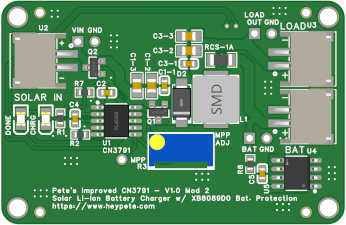

# Pete's Improved CN3791

## Introduction
I wanted a small, efficient, switch-mode, MPPT lithium-ion charger for some of my solar-powered [Meshtastic](https://www.meshtastic.org/) nodes and found the CN3791, made by [Shanghai Consonance](http://www.consonance-elec.com/en/), which seemed to fit the bill.

Various online vendors sell a common CN3791 board that looks like this:

  

However, I don't like these boards for several reasons:
1. The Maximum Power Point voltage is set by R1 and R2, which form a voltage divider between Vin and GND, with the midpoint going to the chip's MPPT pin. These come set from the factory with several options for nominal input voltages (5V, 6V, 9V, and 12V) and cannot be set or adjusted by the user except by replacing tiny 0603 resistors.
2. The layout is horrendous, and doesn't follow [good layout design](files/rohm-buck-converter-application-note.pdf) for buck converters (or even the layout recommendations in the [datasheet](files/Datasheet_CN3791.pdf)). Specifically:
    1. The capacitors are really far from the switching MOSFET at the top making the AC current loop needlessly large.
	2. It uses a big electrolytic capacitor, but no ceramic capacitor on the input. I dislike using electrolytics due to their aging in hot environments, like a rooftop enclosure roasting in the sun. Also, C3 and R4 are for loop compensation, and C2 is for the internal power supply for the P-channel MOSFET driver. C2 and C3 aren't decoupling capacitors.
	3. It has no reverse polarity protection on the input, which could result in the board being damaged if the input is connected in reverse, as well as letting the battery potentially discharge through a solar panel at night if the panel doesn't have a blocking diode (many small ones don't).
	4. The output capacitors don't follow the datasheet's recommendation (or good practice) to be connected to the same copper as the input capacitors before tying into the system ground.
	5. It uses a tantalum output capacitor. I prefer ceramic capacitors since "bursting into flame" is not one of their failure modes.
	6. It has unprotected parallel input and output connectors for no apparent reason.
	7. The load would presumably be attached to the battery (or the second BAT connector). The load current would be added to the charge current going through the current sense resistor, which would interfere with charge termination.
	8. They have no mounting holes.
	9. The 50 ohm current sense resistor sets a charge limit of 2.4A.

Therefore, I set out to design my own. Read on!

**Terminology note**: MPPT stands for "maximum power point tracking", where a controller adjusts the current drawn by the load to maximum the power available from the source as conditions vary, such as when the sun is shaded by a cloud or temperatures change. Constant-voltage "MPPT" controllers like the CN3791 are much more basic than "true MPPT" controllers, and maximize the delivered power subject to the maximum charge current limit and the ability of the source to maintain the user-specified MPP voltage. If the input voltage falls below the MPP voltage, the controller will dynamically reduce the charge current to maintain the MPP voltage. One could argue that constant voltage MPPT controllers are not, strictly speaking, MPPT since they don't actually *track* the maximum power point. However, several manufacturer of similar ICs use the "MPPT" descriptor and I'll use that same terminology here.

## Pete's Improved CN3791 Board
### Basic Design Principles
I wanted my board to fulfil the following requirements:
1. Be compact in size, ideally around 2" (~5.1 cm) long and 1" (~2.5 cm) wide.
2. Have reverse polarity protection on the input, protecting against incorrectly connected solar panels and reverse current flow at night. Ideally avoid the use of a diode for reverse protection due to the relatively large forward voltage drop and power dissipation.
3. Use [good layout design](files/rohm-buck-converter-application-note.pdf).
4. Use only ceramic capacitors.
5. Have 2 mm mounting holes.
6. Be able to accept input voltages up to around 25V DC.
7. Be modular to allow several design variants, namely:
    1. A "core" that includes the key power supply elements, connectors, etc. but nothing else.
	2. A variant with a [DW01A](https://www.best-microcontroller-projects.com/dw01a.html) battery protection chip, for those who want to safely maximize the energy they can get out of their battery by having a low-voltage cut-off limit of 2.5V.
	3. A variant with a battery protection chip with a higher cut-off voltage to play nice with RAK Wireless Meshtastaic nodes; some people have reported "brownout" issues when the battery voltage gets too low. I ended up making two variants, one with a [XB8089D0](files/Datasheet_XB8089D0.pdf) (10A overcurrent limit) and one with a [XB5358D0](files/Datasheet_XB5358D0.pdf) (3.3A overcurrent limit). Both have a low-voltage cut-off limit of 2.9V, which is perfect.
8. Have only the battery current pass through the current sense resistor. The load should be connected before the resistor so the charger can properly detect the charging current and terminate the charge when appropriate.
9. Allow for user-adjustable MPP voltage.
10. Allow for user-adjustable maximum charge current.

As of this writing, I've designed variants that fulfil items #1-9, and intend to add #10 in the near future.

### Design Variants
#### Unprotected "Core" Module (Mod 0)
This is the basic core that is used in my other variants. The schematic shows all the connections, while the rendering shows the layout.

##### Specifications
- Dimensions: 2" long, 1" wide.
- Connectors: 5A-rated JST 2.0mm PH connectors.
- Holes: 0.1"-spaced holes for pin headers. Connected to Vin, LOAD OUT, BAT, GND, and MPP.
- Input voltage range: 4.5V to 28V. (Absolute max: 30V)
- Output voltage (BAT): <= 4.2V (max).
- Output voltage (LOAD): <= 4.32V (w/ 1A charge current).
- Current (Vin, LOAD, and BAT connectors): 3 A (max).
- Temperature range: -25C to +70C.
- Battery protection: None.
- 1oz copper thickness. Traces sized to handle up to around 3A.

##### Remarks

The key feature is the large blue multi-turn potentiometer at the bottom. The voltage between the MPP test point and GND can be measured and the potentiometer adjusted to set the MPP voltage (Set Vmpp = 1.205V at the MPP voltage, though this may need some minor adjustments.).

I'd like to draw your attention to the P-channel MOSFET Q2 ([datasheet](files/Datasheet_AO3401A.pdf)) connected on the input, which provides reverse current protection without the relatively large forward voltage drop of a diode. This protects against both reverse-connected input power sources (up to 30V) as well as reverse current flow into a solar panel without a blocking diode.

Typical Vds with a charge current of 1A is between 10-50mV, depending on the input voltage. The gate for this MOSFET is connected to the VG pin on the CN3791, which produces a positive voltage up to around 6.3V *less* than the input voltage (i.e., if Vin is 16V relative to GND, VG will be around 9.7V). This is primarially used to power the internal gate driver for the gate on Q1, the P-channel MOSFET that's part of the switch-mode buck converter. VG is active whenever Vin is greater than 3.8V. Below that, the CN3791 goes into a low-power mode, turns off the internal gate driver, and VG equals Vin.

The C1-x capacitors are the input capacitors, and are located very close to both Q1 and the CN3791. The current path through Aq, Schottky diode D2, and the inductor L1 is as small as I could reasonably make it. C3-x are the output capacitors and are connected to the same copper plane as the input capacitors.

Also note the LOAD connector is connected to the inductor's output before the current sense resistor, so load current isn't sensed by the CN3791. Only the battery current and voltage is sensed to allow for proper charge termination. There is, of course, a small voltage difference between the positive BAT and LOAD terminals when current is flowing through the sense resistor, but this is at most equal to 120 milliohms times the current.

The sense lines for the battery voltage and current through the sense resistor use a four-wire kelvin connection under the sense resistor connected to vias leading to the back layer of the board. These lines then come back to the top layer of the board and return to the CN3791 while staying as far as possible from high-current paths and switching components. The datasheet does not call for filtering capacitors on the sense lines. The vias for the sense lines on the top of the board (i.e., the ones immediately to the left of the LOAD OUT hole) are untented and are available to probe with a multimeter.

The current sense resistor is 120 milliohms, which corresponds to a maximum current limit of 1A. The user can replace this resistor with others (e.g. 240 milliohms gives 500mA, 50 milliohms gives 2.4A, etc.).

Each corner has a large, 2 mm mounting hole that is electrically isolated from the board's ground planes. The smaller holes are required for the assembly process, are also isolated from the ground planes, and could be used for mounting if one wishes.

LEDs indicate when the battery is charging (yellow) and when charging is complete (green).

#### Core + DW01A Battery Protection IC (Mod 1)

Here's a rendering of the Mod 1 variant of the board, which is the core + a DW01A battery protection IC + a 8205A dual MOSFET for current sensing and disconnecting the battery when faults are detected.

This board is 2" by 1.3".

The 8205A limits the maximum current through the BAT connector to about 3A.

All other specifications are the same as the core board.

#### Core + XB8089D0 Battery Protection IC (Mod 2)

  
*[The initial prototype version](#hardware-revisions). The rough texture near R1 (immediately below the SOLAR IN text) is excess flux from my hand-reworking of these prototype boards to replace the R1 resistor that I hadn't cleaned yet.*

The Mod 2 variant uses an XB8089D0 for battery protection. It has a overdischarge low-voltage cutoff of 2.9V, does not require an external MOSFET, and has an overcurrent limit of 10A.

#### Core + XB5358D0 Battery Protection IC (Mod 3)

The Mod 3 variant uses an XB53538D0 for battery protection. It also has an overdischarge low-voltage cutoff of 2.9V, doesn't require an external MOSFET, and has an overcurrent limit of 3.3A.

### Design Approach & Calculations
The core of this board is a [buck converter](https://en.wikipedia.org/wiki/Buck_converter) driven by the CN3791. Fortunately, there's a lot of good information available from a variety of sources regarding how to properly design one. Since I'm a technical person, I'm going to walk through the calculations and design considerations that went into designing this board here.

My primary references are the [CN3791 datasheet](files/Datasheet_CN3791.pdf), [PCB Layout Techniques of Buck Converter](files/rohm-buck-converter-application-note.pdf) by Rohm Semiconductor, and [Basic Calculation of a Buck Converter's Power Stage](files/slva477b.pdf) by Texas Instruments.

#### Resistor Selection
##### MPP Voltage
The CN3791 datasheet says that the MPP voltage can be set with a resistor divider network as follows: `Vmpp = 1.205 * (1 + R3/R4)`. My board replaces the fixed resistors R3 and R4 with a potentiometer where the wiper is connected to the MPPT pin, allowing the user to set the MPP voltage.

As a general rule of thumb, I like to have voltage dividers have a total resistance of around 100,000 times the input voltage. Since most of my nodes use 5V solar panels, I chose a 500,000 ohm potentiometer which results in a current of 10 microamps through the potentiometer. I designed the board for up to 28V input, so 28V going into 500 kohms results in 56 uA through the potentiometer. The worst-case power dissipation is less than 2 mW, which is well within its 500mW rating.

Texas Instruments' [Basic Calculation of a Buck Converter's Power Stage](files/slva477b.pdf) application note says that the current through resistive divider to ground must be at least 100 times the feedback bias current in order to add less than 1% inaccuracy to the voltage measurement.

The CN3791 datasheet says the MPPT feedback pin is high-impedance and typically no current flows through it, but that up to 100 nA might flow. With a 500 kohm potentiometer and 4.5V minimum input voltage, the current through the potentiometer is 9 uA, or 90x the maximum feedback pin current, which is close enough to 100x for me and I've not observed any feedback instability during testing.

##### Maximum Charge Current
The maximum charge current is set with the Rcs resistor, `Ich = 120 mV / Rcs`. I wanted a 1A maximum charge current, so I used a 120 mohm (0.120 ohm) resistor. I wanted to minimize board space, so I would prefer a 1206 resistor rather than the larger 2512 used by other modules. The resistor I selected has a 250mW maximum power limit. At 1A, the power dissipated by the resistor is `P = (1 A)^2 * (0.120 ohms) = 120mW`, which is more than half the maximum of the resistor rating, which leaves a generous margin. The resistor is also soldered to wide copper traces that can help with power dissipation.

##### LED Current-Limiting Resistor
The DONE and CHRG LEDs are connected to VCC and the CN3791's inverse DONE and inverse CHRG pins to ground. The CN3791's pins can handle a minimum of 7 mA each and the LEDs have a maximum current limit of 10 mA (DONE) and 20 mA (CHRG), respectively. Since the LEDs are mutually exclusive and can't be on at the same time, a single current-limiting resistor can be used.

The forward voltage drop of the green DONE LED is 2.9V, while the yellow CHRG LED has a forward voltage drop of 2.2 V.

The maximum input voltage of the board is 28V, so neglecting the voltage drop, a 10 kohm resistor will result in a maximum current of 2.8 mA, well below the LED's limits. The maximum power dissipated by a 10 kohm resistor passing 2.8 mA is 78.4 mW, which is below the resistor's 100 mW rating. At lower voltages, the power dissipated by the resistor decreases substantially: with an input voltage of 12V, the resistor dissipates about 15 mW.

#### MOSFET Selection
The core module uses two P-channel MOSFETs: one for reverse polarity/leakage current protection, and one as the switching element. I wanted both to have a drain-source voltage limit of at least 30V, a continuious current rating of at least 3A, a low turn-on threshold voltage, a low drain-source on-resistance with a gate-source voltage of -4.5V (the minimum voltage at which the CN3791 will run the switcher), a maximum gate-source voltage of at least -10V (the CN3791 clamps the drive voltage to -8V), and a low total gate charge and reverse transfer capacitance.

The [AO3401A MOSFET](files/Datasheet_AO3401A.pdf) seems to match all these requirements. It has a drain-source voltage of 30V, a continuious current rating of 3.2A at 70C (4A at 25C), a turn-on threshold voltage of -0.9V, a maximum drain-source on resistance of 60 mohm at Vgs=-4.5V (typically 47 mohm), a maximum drain-source on resistance of 85 mohm (typ. 60) at Vgs=-2.5 which is less than the CN3791's turn-on voltage, a maximum gate-source voltage of -12V, and a reverse transfer capacitance of 55 pF.

A common Figure of Merit for switching MOSFETs is `FOM = Rds(on) * Qg`, or the drain-source on resistance multiplied by the gate charge. Using the typical values with a gate-source voltage of -4.5V, the FOM is `47 (mohm) * 7 (nC) = 329`. This compares favorably to other MOSFETs I was able to locate, particularly those as readily available and inexpensive as the AO3401A. Thermal camera testing shows the switching MOSFET's package surface is about 60-65 degrees Celsius in ambient conditions when connected to a 24V solar panel and the charging board is charging a battery at 1A. 

The CN3791 datasheet provides a formula for calculating the power dissipated by the transistor: `Pd = (Vbat/Vcc) * (Rds(on)) * (Ich)^2 + (1+0.005 dT)`, where dT is the difference between actual ambient temperature and room temperature. I plugged in worst-case values of Rds(on)=60 mohm, Vbat=4.2V, Vcc=4.5V, Ich=1A, and dT=80C (assuming room temperature is 20C and the operating temperature is 100C). The result is a power dissipation of 79 mW, which is well within the MOSFET's limit of 900 mW at 70C ambient.

For the reverse polarity protection MOSFET, the CN3791 datasheet recomments a 22 kohm gate resistor connected to the VD pin of the IC. Thermal camera testing of the AO3401A used for reverse polarity protection shows the MOSFET is essentially at ambient temperature with no significant temperature rise.

<!-- Another option is the 8-pin NCE4435, which has a 7.2A current limit at 70C, typical 21 mohm RDSon @-4.5V, 35 mohm RDSon max @-4.5V, total gate charge of 30 nC @-10V (~18 @-4.5V), and a FOM of 378 @-4.5V and 630 @-10V. All of these are within spec for the CN3795. -->

#### Diode Selection
The CN3791 datasheet specifies the diode must be a Schottky diode with a current limit of at least the maximum charge current and a voltage rating of at least the maximum expect input voltage. However, they warn against diodes being excessively large as they'd have larger transition losses due to having a larger capacitance.

The [SS54 diode](files/Datasheet_SS54.pdf) meets those requirements: it has a maximum peak reverse/blocking voltage of 40V, a maximum average forward current of 5A, and a low maximum forward diode drop of 550mV. Capacitance is only 500 pF.

#### Inductor Selection
The CN3791 datasheet says that the inductance `L` of the inductor should be chosen such that that:
- It limits the ripple current to "within a reasonable range", which they define as `0.3 * Ich` amps. For a 1 A charge current, that comes out to 300 mA.
- `Lmin > 5 * (Vcc - Vbat)` microhenries (uH).

The datasheet gives an equation that can be rewritten to allow one to calculate the inductance: `L = (1/(f*Iripple))*Vbat*(1-(Vbat/VCC))`.

If f = 300,000 Hz (given in the datasheet) Iripple = 0.3 A, Vbat = 4.2V, and VCC = 4.5V, this yields an inductance of 3.1 uH minimum.

TI's application note says that a reasonable range for ripple current as 0.2-0.4 times the maximum charge current, so 0.3 seems to be reasonable.

TI gives an equation for calculating a good inductor value that I've rewritten with consistent notation as: `L = (Vbat * (Vcc - Vbat))/(Iripple * f * Vcc)`. Using the same parameters as above, this also gives a recommendation of 3.1 uH. Nice.

I plan to make a variant with user-selectable charge current as low as 500 mA, which would require at least a 6.1 uH inductor. Inductors typically have an uncertainty of +/- 20%, so a 10 uH inductor would give plenty of margin for the system during the worst-case scenario of low charge current and a low Vcc. It also meets the `L > 5 * (Vcc - Vbat)` uH requirement.

I selected a 10 uH molded inductor with a current limit of 5.5 A. The inductor windings are molded into an "alloy sponge powder" which minimizes coil vibration and magnetic field leakage from the inductor. The widely available CN3791 modules from other vendors also often use a 10 uF inductor, so this matches my decision-making process.

#### Capacitor Selection
##### Input Capacitors
The CN3791 datasheet recommends the following input capacitors:
- An electrolytic capacitor (capacitance unspecified) for low-frequency filtering.
- A ceramic capacitor with a value between 1 uF to 10 uF.
- A high-frequency capacitor with a value between 0.047 uF and 1 uF.

TI's application note states to follow the datasheet recommendation and use low-ESR ceramic capacitors of X5R dielectric or better.

I wanted to avoid electrolytic capacitors, so I used three ceramic capacitors: a 10 uF one to fulfil the first requirement, a 2.2 uF one for the second, and a 0.1 uF one for the third. All use dielectrics X5R or X7R.

The CN3791 boards from other vendors have only 47 uF electrolytic capacitor on their input, and no other ceramic input capacitors. The ceramic capacitors around the CN3791 are for the loop compensation and gate driver power supply, not for the IC itself or the switching MOSFET.

The input capacitors are located as close as possible to the switching MOSFET and the CN3791's VCC pin and are connected to a large ground plane.

All input capacitors are rated to 50V.

##### Output Capacitors
The datasheet recommends:
- A 10 uF electrolytic capacitor for low-frequency filtering.
- A ceramic capacitor in the range of 1-10 uF.

TI's application note recommends low-ESR ceramic capacitors with X5R or better dielectric.

They provide a formula to calculate the minimim capacitance desired output voltage ripple: `Cout = (Iripple)/(8 * f * dVout)`, where dVout is the desired output voltage ripple. For Iripple = 0.3A, f = 300,000 Hz, and dVout = 0.050 volts, I need at least 2.5 uF of output capacitance.

TI also says the capacitor's ESR adds some more ripple to the output voltage. The ripple from the capacitor ESR can be calculated as `Vout_esr = ESR * Iripple`. For an ESR of 0.1 mohm at 300 kHz (the highest value out of my input capacitors), that would add 0.030 V ripple, for a total of 0.080 V ripple maximum.

TI's application note also includes an equation to calculate the minimum output capacitance due to the output transint response of the system causing a voltage overshoot: `Vout_min_os = (dIout^2 * L)/(2 * Vbat * Vos)`, where dIout is the maximum output current change in the application (I used 0.5 A, as there generally shouldn't be large current transients when charging a battery), L 10 uH, Vbat = 4.2V, and Vos = 0.050 V, which results in a minimum capacitance of about 6 uH.

To minimize the BOM on the board and to ease design, I simply used the same type and value capacitors for the output as I did for the input. They are placed as close as possible to the inductor output and the input capacitors and are connected to the same large ground plane as the input capacitors. Since I'm using the same capacitors for both input and output, the output capacitors are also rated to 50V.

For reference, the CN3791 boards from other vendors use a 10 uF tantalum capacitor and an unknown ceramic capacitor far from the input capacitor, which is less than ideal.

##### Other Capacitors
The datasheet calls for a 0.22 uF ceramic capacitor in series with a 120 ohm resistor between the CN3791's COM pin and GND for loop compensation. COM never exceeds 6.5V, so I used a 25V capacitor.

The VG pin requires a 0.10 uF ceramic capacitor between the VG and VCC pin. VG is clamped such that `(VCC - VG) = 8 V` max. Just to be safe, I used a 50V capacitor.

Nick, an engineer at Shanghai Consonance, stated that any noise on the CSP and BAT pins could be reduced by adding 100 ohm resistors in series with the traces from the current sense resistor, and a 1 uF capacitor between the two sense lines. He even provided a [helpful diagram](images/csp-bat-noise-reduction-schematic.png). (Thanks, Nick!)

#### Efficiency & Thermal Calculations

### Hardware Revisions
- **Pre-production prototype**. June 2025. Limited run of 10 boards made by JLCPCB. Green soldermask with lead-free HASL pads. Labeled "V1.0" on silkscreen and handwritten Sharpie markings numbering each unit (P1-P10).
    - Initial design of the XB8089D0 (Mod 2) variant.
	- I manually reworked all the prototype boards to replace R1 with a 10 kohm resistor and marked those boards with "10k" in Sharpie to reflect that update. (See Version 1.0 below for details.)
	
- **Version 1.0** Labeled "V1.0" on the silkscreen. No Sharpie markings.
    - Bugs fixed in this version:
	    - The GND hole next to LOAD OUT was incorrectly sized and was too small for standard pin headers. Hole resized to match other holes (0.060" pad, 0.040" hole).
	    - The MPP hole was too close to the potentiometer and made things a bit crowded when holding multimeter probes and a screwdriver. It was moved somewhat further away.
	    - The BAT and GND hole positions and labels were reversed, such that BAT was on the right and GND was on the left. Although correctly labeled, the inconsistency in positioning could be confusing. This was the opposite of the Vin/GND and LOAD OUT/GND holes, and was updated to be consistent with the others.
    	- The polarity markings by each of the JST connectors was 0.045" in height, which was very small. The size was increased to 0.060".
    	- The vias for the sense lines were tented and not easily usable as test points. The design was updated to exclude soldermask from the tops of the vias.
    	- R1 was incorrectly specified as 3.3 kohms, which made the DONE LED stupendously bright (even though it was around half the rated current). At voltages above 18V, the power dissipated by that resistor exceeded its maximum limit. I updated the design to use 10 kohm resistors to reduce the current and power dissipation, which helps with the brightness of DONE (at the cost of making CHRG dimmer).
		
- **Version 1.1** Labeled "V1.1" on the silkscreen.
	- Enlarged copper pads on the VIN, LOAD, BAT, and MPPT terminals.
	- Enlarged copper pads on the current sense resistor vias to allow for testing.
	- Remove assembly holes required by JLCPCB.
	- Remove "-1A" from the current sense resistor silkscreen since this resistor can be replaced with any arbitrary resistor.