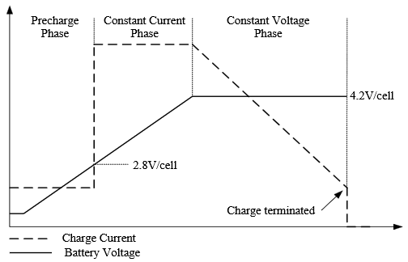

# Pete's Guide to Solar Li-Ion Battery Charger Chips & Circuits

## Introduction
Recently I've been building some small, solar-powered [Meshtastic](https://meshtastic.org/) nodes to expand the mesh network coverage in my area. Due to their small size and power efficiency, I have been using [RAK 4631 WisBlock](https://store.rakwireless.com/products/wisblock-meshtastic-starter-kit) systems as the core of these modules.

The WisBlock base boards include a [TP4054](#TP4054) -- a compact (SOT-23-5 sized), linear lithium-ion (Li-Ion) charger chip to charge a Li-Ion battery connected to the module. Power for the TP4054 can be provided by either a 5V USB connection or a 5V solar panel (or other power source) connected to the board's "SOLAR" input connector.

While I'll discuss the [TP4054 in more detail later](#TP4054), I wanted to mention that I like it in its intended role as a USB-powered battery charger and will briefly list its shortcomings when connected to a solar panel:
1. It has a limited input voltage range (4.5-5.5V).
2. It has a limited charge current (500mA max, configured for 300mA on the RAK board).
3. It is unable to effectively handle an inherently variable, unstable power source like a solar panel.

These shortcomings led me to investigate alternative chargers and create this page. I hope you find it useful.

***
## Technical Background
### Li-Ion Batteries
[Lithium-ion batteries](https://en.wikipedia.org/wiki/Lithium-ion_battery) have many desirable properties that make them useful for powering electronics:
1. They provide a convenient voltage (nominally 3.7V, up to 4.2V).
2. They are quite energy-dense and able to store a lot of energy in a small volume.
3. They do not exhibit any memory effect, unlike some other battery chemistries.
4. Their charging requirements are [easy to meet](#constant-currentconstant-voltage-charging).
5. They are available in huge abundance at a reasonable cost and in a variety of shapes, sizes, and form factors.
6. They can be recharged numerous times (typically several hundred times).

#### Charging Requirements
Lithium-ion batteries can be damaged (sometimes to the point of bursting into flames) if overcharged, overdischarged, or otherwise abused. Thus, it is crucial to charge them in a regulated, controlled manner. The typical approach is called "constant-current/constant-voltage", [described below](#constant-currentconstant-voltage-charging).

##### Constant Current/Constant Voltage Charging
The typical charge profile (see [Figure 1](#figure1)) for a lithium-ion battery is as follows:
1. If the battery voltage is below a certain level, gently "precharge" it at a lower current until it's ready for the full charging current.
2. Charge at a constant current until the battery voltage reaches 4.2 volts.
   - The maximum safe current for a given battery depends on its capacity *C* and is typically around 0.5C. For example, a battery with a capacity of 1000mAh (or 1Ah) has a C of 1A and a a typical safe charging current would be (0.5 \* 1A) = 0.5A, while a battery with a capacity of 2000mAh (or 2Ah) has a C of 2A and a safe charging current of 1A. Check with the battery's datasheet for details.
3. When the battery voltage reaches 4.2 volts, charge at a constant voltage.
   - As the battery continues to charge at a constant voltage, the charge current needed to maintain that voltage will decrease over time.
4. When the charge current falls below a certain threshold, generally around 0.1C, stop charging.
5. Once the battery voltage decreases below a certain threshold (whether due to self-discharge or being drawn down by the load), a new charge cycle is started and the battery charged again.
   - Unlike lead-acid batteries, lithium-ion batteries are intolerant of "float" charging where a constant charging voltage is applied to counteract self-discharge. This can rapidly destroy a Li-ion battery.

Note that it is not strictly required to charge at a constant current; a time-varying current can be used so long as the current does not exceed the maximum safe limit. It's always safe to charge a battery slower than the maximum, though charging can take longer.

  
*Figure 1: Lithium-Ion Charging Profile (Image source: Shanghai Ruyun Electronics Co, Ltd., [CN3791 datasheet](http://www.consonance-elec.com/en/72.html).)*

### Battery Protection
For safety, a lithium-ion battery must be protected from overcharge, overdischarge, or excessive current, all of which can cause premature aging or permanent damage to the battery. In some cases, such damage can cause the battery to fail violently (e.g., by catching on fire).

It's generally a good idea to include a battery-protection circuit when one is using a lithium-ion battery that will disconnect the battery when the voltage is outside of a safe range or when overcharged or discharged. Some batteries have their own internal protection circuit, but external protection circuits can be used. There's no harm in using an external protection circuit with an internally-protected battery.

#### Listing of Battery Protection Chips
#### DW01A
The DW01A is a small, SOT-23-6-sized battery protection IC. It's often seen on inexpensive [TP4056 boards](https://www.best-microcontroller-projects.com/tp4056.html) that are available from a variety of vendors, though it's ideally be attached to the battery itself, or to the battery's holder.

Unlike the other protection ICs mentioned below, it requires two external MOSFETs for two purposes: first, to act as a switch to disconnect the battery when needed, and secondly to use the MOSFETs' turn-on resistance as a surrogate current-sense resistor to detect overcurrent and short circuits.

I've commonly seen it paired with an 8205A dual MOSFET whose Rds(ON) is such that the DW01A's overcurrent protection kicks in around 3A. The DW01A's low-voltage cutoff is 2.5V.

More information about the DW01A can be [found here](https://www.best-microcontroller-projects.com/dw01a.html). 

In the context of Meshtastic nodes, the low current drawn by the node allows the battery to be discharged down to its minimum safe voltage of 2.5V before the DW01A disconnects the battery. Higher currents will cause the battery voltage to briefly sag to 2.5V and get cut off sooner.

Additionally, there have been [reports](https://forum.rakwireless.com/t/factory-reset-on-brownout-mcp120-315-connected-to-the-pins-of-the-rak4631/13737) of RAK-based Meshtastic nodes exhibiting unusual behavior when the battery is discharged to too low a voltage (including factory resetting themselves or failing to restart properly after the battery has recharged somewhat). The DW01A's nominal low-voltage cut-off of 2.5 volts is right at the lower limit of what the RAK 4631 module is rated to work with, so discharging the battery to that limit may cause issues.

**Pros**:
- Protects the battery from unsafe conditions.
- Allows for the maximum safe amount of energy to be extracted from the battery before reaching the overdischarge cut-off.
- Extremely inexpensive. (Around $0.04 USD for the DW01, and $0.04 for the 8205A, as of June 2025.)
- External MOSFET allows for a circuit designer to tailor the overcurrent limit to meet their requirements.

**Cons**:
- Requires external MOSFETs.
- May not be the best choice for low-power loads that can malfunction at voltages that, while low, are not low enough to trigger the DW01A's overdischarge cut-off.

#### XB8089D0
8-pin SOP-8 device, integrated MOSFETs.
2.9V

10A

<https://www.etsy.com/listing/1421193059/li-ion-battery-protection-modules-pcm>

$ 0.15 (0.77/5)
#### XB5358D0
SOT-23-5 device, integrated MOSFETS.
2.9V

3.3A

$0.17 ($0.86/5)
### Solar Panels
#### Constant Current vs. Variable Current
### Linear vs. MPPT
#### Linear Charging
#### Maximum Power Point Tracking

***
### Linear Chargers
#### TP4054
$0.022 ($0.45/20)

4.5V-5.5V

500mA max.

#### TP4056
#### CN3065
#### CN3163

***
### Switch-Mode Chargers
#### "MPPT" Chargers
###### CN3791

#### True MPPT Chargers

***
## Testing and Comparison of Chargers
### Test Methods
### Test Results